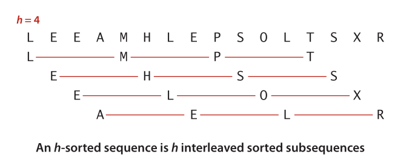

#### 希尔排序算法

##### 描述
在对大规模乱序数据进行排序时插入排序会很慢。因为它只会交换相邻元素，因此元素只能一点一点的从数组的一端移动到另一端。如果恰好最小的元素在数组的最右端，则光移动它就需要N-1次交换。   
希尔排序是对插入排序的简单改进，交换不相邻的元素以对数组的局部进行排序，并最终用插入排序将局部有序的数组排序。   
希尔排序的思想是使数组中任意间隔为h的元素都是有序的。这样的数组被称为h有序数组。一个h有序数组就是h个互相独立的有序数组编制在一起的一个数组（见下图）。在进行排序时，如果h很大，就能将元素移动到很远的地方，为实现更小的h有序创造方便。用这种方式，对于任意以1结尾的h序列，我们都能将数组排序。这就是希尔排序。   

<i class="An h-sorted sequence"></i>   

##### 时间复杂度分析
目前的结论是，它的运行时间达不到平方级别。在已知最坏的情况下，算法的比较次数与 N的3/2次方 成正比。

##### 特点
1. 希尔排序比插入排序和选择排序快得多；
2. 希尔排序可用于大型数组；
3. 希尔排序对任意排列的数组表现很好；
4. 希尔排序的运行时间复杂度无法准确估算；

##### 算法实现
```java

public class Insertion {
    public static void sort(Comparable[] a) {
        // 将a[]按照升序排列
        int N = a.length;
        int h = 1;
        while (h < N/3) h = 3*h + 1;
        while (h >= 1) {
            // 将数组变为h有序
            for (int i=h; i<N; i++) {
                for (int j=i; j>=h && less(a[j], a[j-h]); j-=h)
                    exch(a, a[j], a[j-h])
            }
            h = h/3
        }
    }

    private static boolean less(Comparable v, Comparable w) {
        return v.compareTo(w) < 0;
    }

    private static void exch(Comparable[] a, int i, int j) {
        Comparable t = a[i];
        a[i] = a[j];
        a[j] = t;
    }

    private static void show(Comparable[] a) {
        for (int i = 0; i<a.length; i++) {
            StdOut.print(a[i] + " ");
        }
        StdOut.println();
    }

    public static boolean isSorted(Comparable[] a) {
        for (int i=1; i<a.length; i++) {
            if (a[i] > a[i+1]) return false;
        }
        return true;
    }

    public static void main(string[] args) {
        string[] a = In.readString();
        sort(a);
        assert isSorted(a);
        show(a);
    }
```
