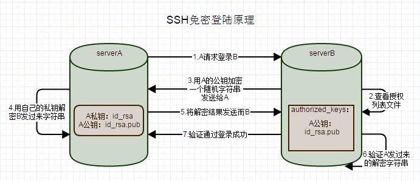

### SSH免密码登录原理

<i class="lock-free"></i>   

<i class="lock-free"></i>   

### 配置过程
#### 环境准备
serverA   
serverB   
目标是配置为从serverA免密码登录到serverB

1. 在serverA上生成密钥对：
```bash
ssh-keygen -t rsa
Generating public/private rsa key pair.
Enter file in which to save the key (/home/binxin/.ssh/id_rsa): 
Enter passphrase (empty for no passphrase): 
Enter same passphrase again: 
Your identification has been saved in /home/binxin/.ssh/id_rsa.
Your public key has been saved in /home/binxin/.ssh/id_rsa.pub.
The key fingerprint is:
f2:f1:00:ca:b0:d0:3c:52:ac:9b:b7:0d:7e:62:f3:39 binxin@serverA
The key's randomart image is:
+--[ RSA 2048]----+
| ..              |
| +.              |
|o.=   .          |
|.o = . .         |
| o. o . S        |
|o o    o +       |
| o +    . .      |
|  * E.           |
| . =o.           |
+-----------------+
```
查看 /root/.ssh/ 目录下密钥对已生成，公钥id_rsa.pub，私钥id_rsa
```bash
[test@serverA ~]$ cd .ssh/
[test@serverA .ssh]$ ls
id_rsa  id_rsa.pub  known_hosts
[test@serverA .ssh]$ 
```

2. 使用scp命令复制serverA的公钥文件id_rsa.pub到serverB
```bash
scp /root/.ssh/id_rsa.pub serverB:/root/
```

3. 登录serverB，将上一步拷贝过来的公钥文件追加到授权列表文件/root/.ssh/authorized_keys，使用下面命令胡自动生成该文件：
```bash
cat /root/is_rsa.pub >> /root/.ssh/authorized_keys
```

4. 修改文件authorized_keys权限为600，目录/root/.ssh权限为700：
```
chmod 600 /root/.ssh/authorized_keys
chmod 700 /root/.ssh
```

5. 检查配置是否成功，从serverA通过SSH登录serverB，发现不用密码就可以登录了：
```
[root@serverA ~]# ssh root@serverB_ip
Last login: Thu Aug 30 23:04:50 2018 from serverA
[root@serverB ~]#
```

6. 禁止serverB使用密码登录
修改serverB上/etc/ssh/sshd_config配置文件，注意不是ssh_config，而是sshd_config：
```bash
    AuthorizedKeysFile   .ssh/authorized_keys   //公钥公钥认证文件
    PubkeyAuthentication yes   //可以使用公钥登录
    PasswordAuthentication no  //不允许使用密码登录
```
重启ssh服务即可   
